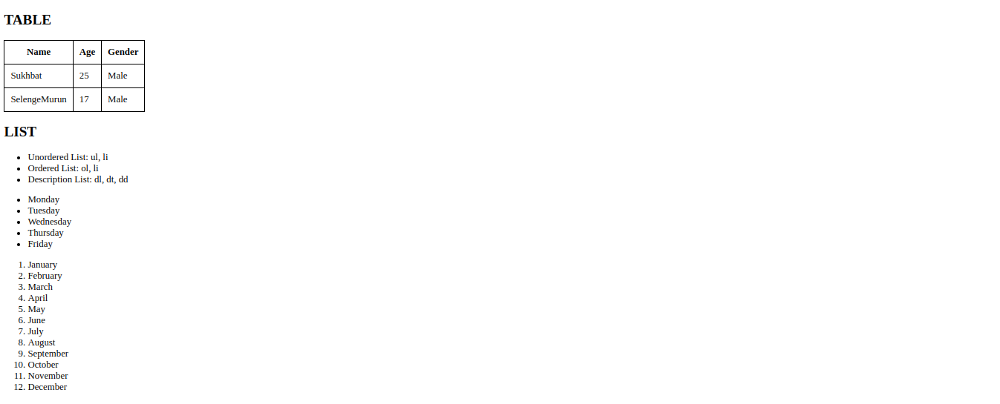
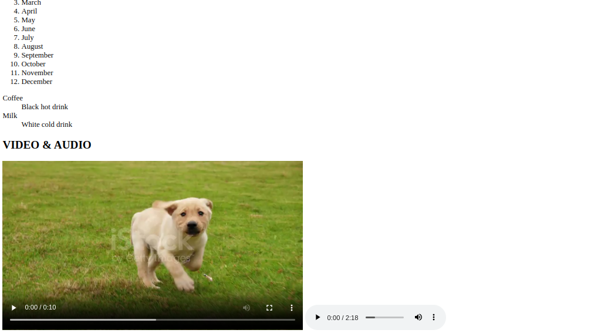

# Hands-on

### 1. CSS бичих аргууд

### 2. Normalize.css

### 3. Selectors

### 4. Inspect Page (devtools) - DOM

### 5. Colors

### 6. Gradients

### 7. Borders

### 8. Shadows

### Links

- Slide url: https://docs.google.com/presentation/d/1cJ4zCEL0QvtRqBvZ7iB3gfGkpoE-i3FIalXq09Dq-XM/edit?usp=sharing
- Video url: https://youtu.be/VOleRYXFamE

