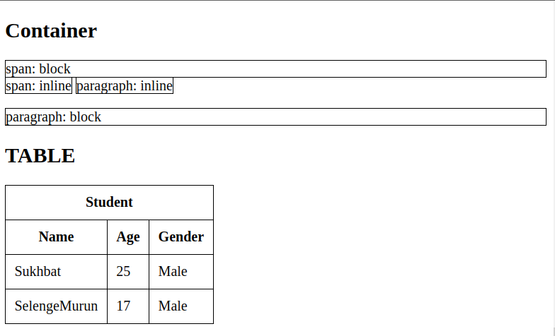

# Hands-on

### 1. Video & Audio : src, autoplay, controls, loop

### 2. List : ul, ol, li, dl, dt, dd

### 3. Table : table, thead, tbody, tr, th, td

### 4. Sematic elements : article, section, mark, main, header, ...

### 5. Web structure : header, main, footer>

### Links

- Slide url: https://docs.google.com/presentation/d/1qev73vyjYMnNm4OqabIteoVabWKuHxomk7K0V3Y1dpY/edit?usp=sharing
- Video url: https://youtu.be/b5Ui8qcr9M8

