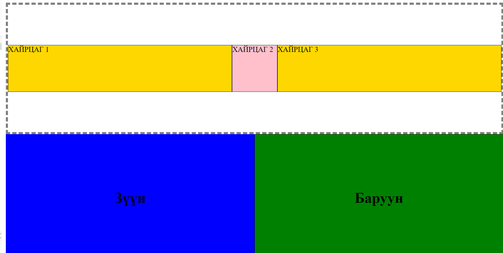

<!-- - Цээжлэх тоглоом: Хүний нэр, нас, ажил, хобби цээжлээд таана

0. https://www.random.org/lists/
1. 3, 3 аараа багт хуваагдана
2. Бүгд нэг нэгээрээ нэр, нас, ажил (сургууль), хобби -гоо бүгдэнд нь танилцуулна
3. Дуусаад дарааллаа сугалана.
4. Дарааллын дагуу гарч ирээд хамгийн олон хүний мэдээлэл цээжилсэн нь хожно

- Шагнал: Хос киноны тасалбар

  
  
   -->

# Хичээл 06 - Flex box layout

- display: flex
- flex-direction : row | column
- justify-content : start | end | center | evenly | between | around
- align-items : start | end | center
- flex-wrap : nowrap | wrap
- flex: 1

  ### Жишээ:

  

  ### Даалгавар

  

### Links

- Slide url: https://docs.google.com/presentation/d/1JRiDGUceWDv59nllVJCWTOuIuh2oYc-z1nUNOUc9FQc/edit?usp=sharing
- Video url: https://youtu.be/OuxzAJXEjo0
