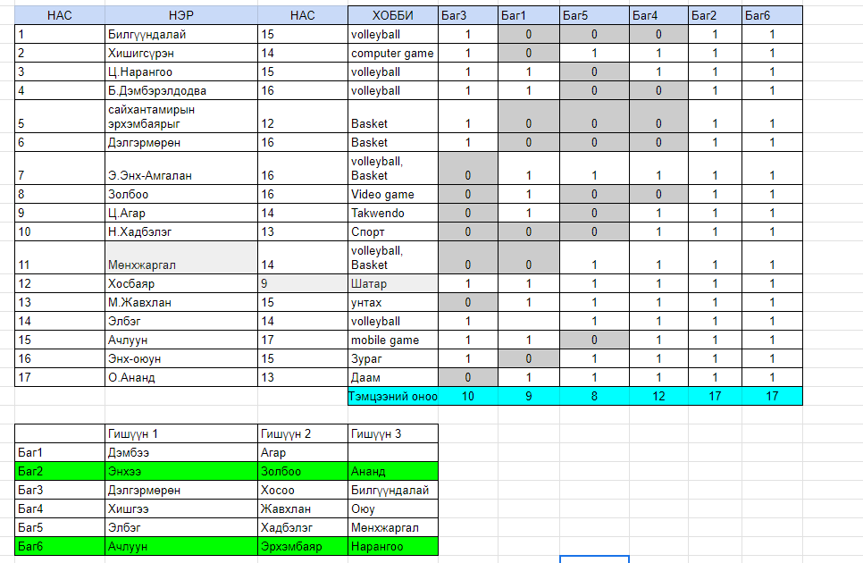

# Хичээл 07: Тэмцээн, баг, танилцуулга сайт

- Цээжлэх тоглоом: Хүний нэр, нас, хобби цээжлээд таана

1. 2 - оороо баг болно
2. Бүгд нэг нэгээрээ нэр, нас, ажил (сургууль), хобби -гоо бүгдэнд нь танилцуулна
3. Дарааллаа сугалана: https://www.random.org/lists/
4. Дарааллын дагуу гарч ирээд ангийн хүүхдүүдээ нэрлэх бөгөөд хамгийн олон хүний мэдээлэл цээжилсэн нь хожно

- Шагнал: Хос киноны тасалбар

## Тэмцээний дүн:

## Багын ажил:

- Багаараа хийх веб хуудасны загвар хайж олно.
- Тэмцээн дээр хуваагдсан багаараа хамтран веб хөгжүүлж эхлэх бөгөөд цаашид хичээлээ багаараа хамтран хийнэ.
- Хичээлийн төгсгөлд хамгийн сайн хамтран ажиллаж веб бүтээсэн багийг шагнана.

  Жишээ сайт:

1. https://ariuq.github.io/web-mba/index.html
2. https://www.wix.com/website-template/view/html/2839
   
   

## Үнэлгээний зарчим:

1. Багийн гишүүдийн ирц - (Багийн гишүүдийн эрцийг дундажлана)
2. Өдөр болгоны онооны нийлбэр
3. Веб сайтыг загвар, хийцийн хувьд үнэлэх
