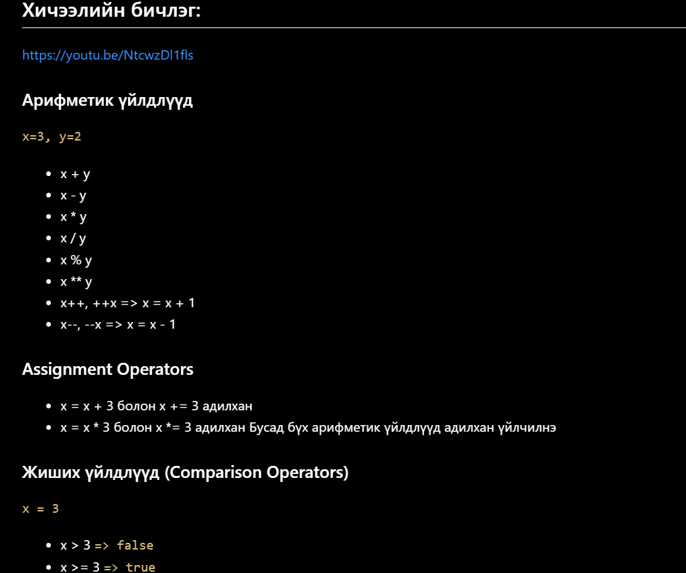

# Lesson12 - JS Basic

0. Kahoot link, code (10 минут): link

- 3 оноо

1. Лекц (30 минут):
   
2. Завсарлага (5-10 минут)
3. Дасгал ажил (90-120 минут):

- 6 оноо: Даалгавар биелүүлэх дээр оноо цуглуулна: 6 хүртэл (3 хялбар \* 0.5 + 2 дундаж \* 1 + 1 \* 2.5)

...

4. Оноо цуглуулах:

- Ирц: 1
- Бататгах тест: 3
- Даалгавар биелүүлэх дээр оноо цуглуулна: 6 хүртэл (3 хялбар \* 0.5 + 2 дундаж \* 1 + 1 \* 2.5)
- Бусдад мэдсэн зүйлсээ хуваалцсан тохиолдолд багшаас оноо авах боломжтой: 1

5. Хичээл дуусахад чадаагүй бодлого байвал хэрхэн хийх талаар тайлбар, заавар текст, бичлэг авах боломжоор хангах. Оноо авахгүй. @task - ariud015@gmail.com
6. Ил тод байдал: Онооны жагсаалт (Leaderboard) мөн урамшууллийн мэдээллийг ил, тодорхой байлгах. Өрсөлдөөн үүсгэх. Онооны жагсаалтаар жагсааж харуулна эхний 5 н сурагч харагдаадд бусад нь нууцлалтай өөрсдөө л байраа мэднэ. Тухайн сургалтын @task - ariud015@gmail.com Оноо хөтлөх болон харуулах
   Оноогоор Тухайн насанд тохирсон байдлаар урамшуулах, боломж олгох.
7. 1 өдрийн хичээлийн дүгнэлт:

- Хугацаа: 2:20 - 2:50
- Боломжит оноо: 10
