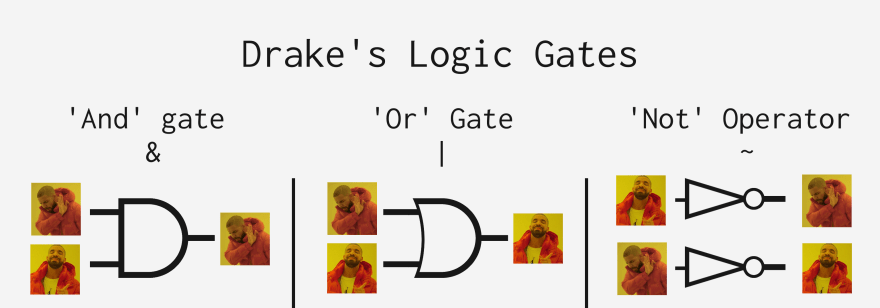

# Lesson13 - JS Basic

0. Бодлого тайлбар - 5 минут
1. Kahoot-тэй танилцуулах хост линк: https://create.kahoot.it/details/739c6780-b383-463f-9a9c-c9d1d9214fab
   Kahoot link: https://kahoot.it/

- 3 оноо

1. Лекц (30 минут):

   ## Хичээлийн бичлэг:

   https://youtu.be/NtcwzDl1fls

   ### Арифметик үйлдлүүд

   ` x=3, y=2`

   - x + y
   - x - y
   - x \* y
   - x / y
   - x % y
   - x \*\* y
   - x++, ++x => x = x + 1
   - x--, --x => x = x - 1

   ### Assignment Operators

   - x = x + 3 болон x += 3 адилхан
   - x = x \* 3 болон x \*= 3 адилхан
     Бусад бүх арифметик үйлдлүүд адилхан үйлчилнэ

   ### Жиших үйлдлүүд (Comparison Operators)

   `x = 3`

   - x > 3 `=> false`
   - x >= 3 `=> true`
   - x < 3 `=> false`
   - x <= 3 `=> true`
   - x === 3 `=> true` (Төрөл + утга), x == 3 (Зөвхөн утга)
   - x !== 3 `=> false`

   #

   - x === 3 (Төрөл + утга)
   - x == 3 (Зөвхөн утга):

   ### Гурвалсан үйлдлүүд

   ```sh
   let age = 16;
   const isAdult = age >= 18 ? 'Насанд хүрсэн' : 'Насанд хүрээгүй';
   // Үр дүн: 'Насанд хүрээгүй'
   ```

   ### Логик үйлдлүүд

   - && : and буюу бүгд биелэж байх үед "үнэн"
   - || : or буюу аль нэг нь л биелэх үед "үнэн"
   - ! : not буюу үнэн үед "худал", худал үед "үнэн"

     

   ```sh
   const skills = {
   frontend: true,
   backend: true,
   };
   # Ажлын зар fullstack хөгжүүлэгч авна
   let isFullstack = skills.frontend && skills.backend;
   # Үгүйсгэл (!)
   let notAccepted = !isFullstack

   # frontend, backend хөгжүүлэгч авна:
   let isDeveloper = skills.frontend || skills.backend;
   let notAccepted = !isDeveloper
   ```

   ### Logical Operators with Non-booleans

   ```sh
   false || true
   false || 'text' =>
   false || 1
   ```

2. Завсарлага (5-10 минут)

3. Дасгал ажил (90-120 минут):

   
- Тус бүр 0.5 оноо:

   1. Хувьсагчийн байрыг солих

   2. Өгөгдсөн илэрхийллийн утгыг ол. A=B\*C-D
      B, C, D утгийг гараас авна

   3. Дасгал 3: Гараас хоног, цаг өгсөн бол нийт цаг хэд вэ?

- Тус бүр 1 оноо:
   4. Гараас 0-100 хооронд оноо өгөх бөгөөд тухайн оноо нь ямар дүн авсныг хэвлэж үзүүлэх "checkPoint" функц зохио :

      - 90 : 'A'
      - 80 - 89: 'B'
      - 70 - 79: 'C'
      - 60 - 69: 'D'
      - < 60 : 'F'
      гэж хэвлэнэ

      - checkPoint(81) ==> Үр дүн: B
      - checkPoint(96) ==> Үр дүн: A
   5. 2 тооны ихийг олж буцаадаг функц жиших оператор ашиглан бичээрэй.
         input: max(5,10);
         output: 10;

- Тус бүр 2.5 оноо:

   6.  Миа-д пиццаны үдэшлэг зохион байгуулахад тусалж, түүний бүх найзуудад хангалттай пицца байгаа эсэхийг шалгаад дахин пицца захиалах үгүйг тодорхойлдог дараах функцийг гүйцээгээрэй.
   - Миа найзуудтайгаа пиццаны үдэшлэг хийхээр төлөвлөж байгаа.
   - Хүн бүр(Миаг оруулаад) 2 зүсэм пицца хүсэж байв.
   - Үдэшлэгт нийт хэдэн зүсэм пицца хэрэгтэй вэ?
   - Нэмж пицца захиалах хэрэгтэй юу?
   - Хариугаа console.log дотор хэвлэж хараарай.
         input: calculatePizza(6,8);
         output: 14, zahialna;

```sh
calculatePizza = (naiziinToo, baigaaZusemPizzaniiToo) => {
   #функцийг хэрэгжүүлээрэй.
};
```

6. Оноо цуглуулах:

- Ирц: 1
- Бататгах тест: 3
- Даалгавар биелүүлэх дээр оноо цуглуулна: 6 хүртэл (3 хялбар \* 0.5 + 2 дундаж \* 1 + 1 \* 2.5)
- Бусдад мэдсэн зүйлсээ хуваалцсан тохиолдолд багшаас оноо авах боломжтой: 1

5. Хичээл дуусахад чадаагүй бодлого байвал хэрхэн хийх талаар тайлбар, заавар текст, бичлэг авах боломжоор хангах. Оноо авахгүй. @task - ariud015@gmail.com
6. Ил тод байдал: Онооны жагсаалт (Leaderboard) мөн урамшууллийн мэдээллийг ил, тодорхой байлгах. Өрсөлдөөн үүсгэх. Онооны жагсаалтаар жагсааж харуулна эхний 5 н сурагч харагдаадд бусад нь нууцлалтай өөрсдөө л байраа мэднэ. Тухайн сургалтын @task - ariud015@gmail.com Оноо хөтлөх болон харуулах
   Оноогоор Тухайн насанд тохирсон байдлаар урамшуулах, боломж олгох.
7. 1 өдрийн хичээлийн дүгнэлт:

- Хугацаа: 2:20 - 2:50
- Боломжит оноо: 10
