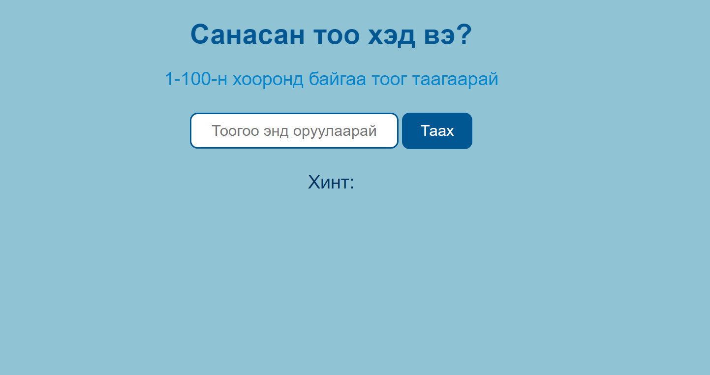

# Хичээл 17: DOM manipulation

Хичээлийн бичлэг: https://youtu.be/4wCuWinVtGI

1. Element Selection
   - id
   - class
   - tag name
2. Style change
3. Create element
4. Modify element
   - innerText
   - attributes & classess : setAttr, removeAttr, getAttr
   - delete element : remove()

Дасгал:

- Дараах загвартай хуудасыг өөрсдийнхөөрөө баяжуулан үүсгээрэй
  
- "Таах" товч дээр дархад Input дээр бичсэн зүйлийг хинт-ийн доор гаргаж ирдэг болгоорой
- input дээр оруулсан тоог хинтийн доор гаргаж ирдэг болгоно.
- Math.random(), Math.floor() ашиглан random тоо үүсгээрэй
- random тоотойгоо input дээр бичсэн тоог жишээд
  - тэнцүү бол "Баяр хүргэе"
  - random тооноос бага бол "Бага байна"
  - random тооноос их бол "Их байна"
    гэж гаргаж ирдэг болгоорой.
