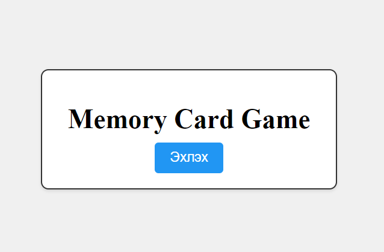
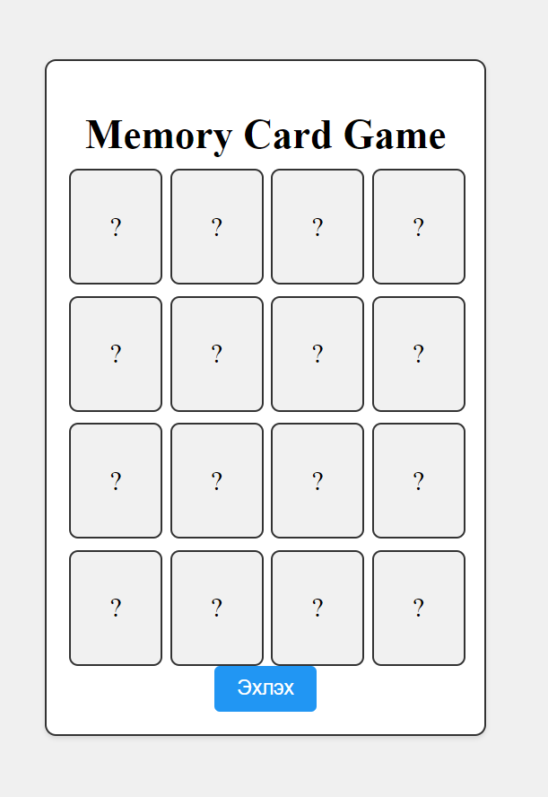
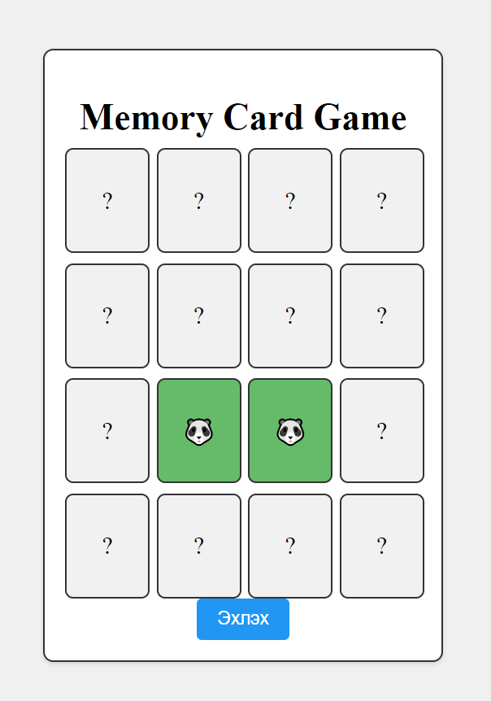
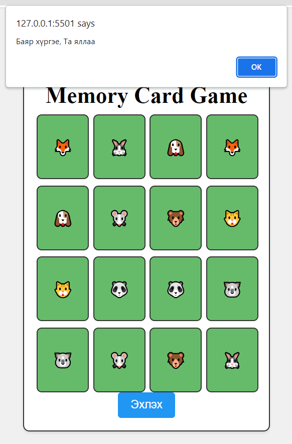

# Хичээл 17: Тоглоом №3

1. Kahoot-тэй танилцуулах хост линк: https://www.kahoot.it
  - 3 оноо

2. Тоглоомны танилцуулга
  - Эхлэх товч дээр дарж тоглоомыг эхлүүлэх ба картыг 2,2-оор нь нээгээд хоорондоо адилхан таарсан үед карт дэлгээтэй үлдээд, хоорондоо таараагүй тохиолдолд картууд буцаад хаагдана. Бүх карт хоорондоо таараад дэлгэгдэх үед тоглоомонд хожино.
  
  
  
  

3. Дасгал:
  - app.js файл дотор код өгөгдсөн ба кодыг тайлж ойлгоод дутуу кодуудыг нөхнө.
  - index.html файл дотор тохирох функцийг дуудна.

4. Гэрийн даалгавар:
  - Дараагийн хичээлийн kahoot тест дээр өмнө авсан тестүүдээс санамсаргүйгээр 10 тест сонгоод оруулах тул өмнөх тестүүдийн хариуг цээжилж ирээрэй. Өмнөх тестийн асуулт болон хариуг facebook группт хичээлийн дараа оруулах болно.
