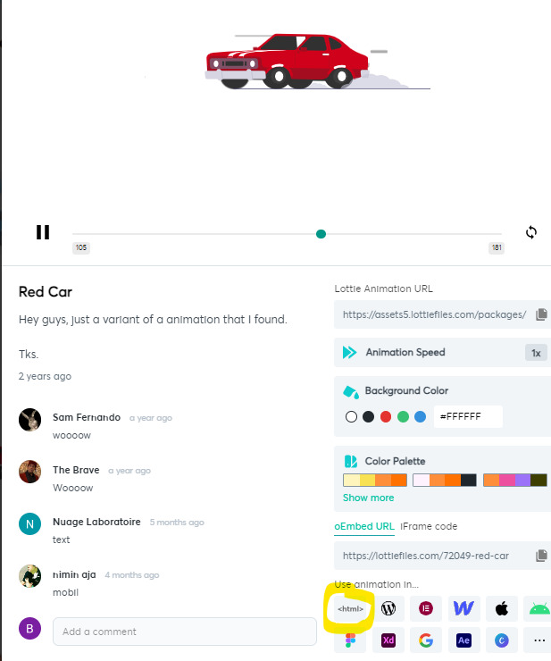
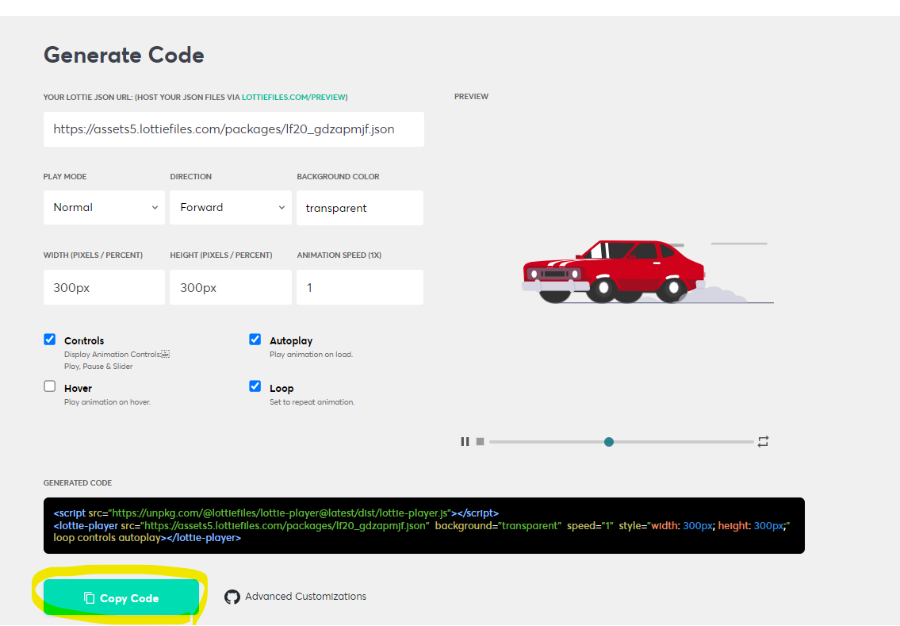

# Lottie файл буюу анимэйшн зураг

Lottie файлууд нь вектор дээр суурилсан хөдөлгөөнт дүрс бөгөөд энэ нь хэмжээнээс шалтгаалж чанараа алдалгүйгээр харагдах боломжтой юм.


### Ашиглах заавар

1. https://lottiefiles.com сайт дээр бүртгэл үүсгэнэ.
2. Өөрийн хүсэж буй lottie файл анимэйшныг сайтаас (https://lottiefiles.com/popular) хайж олно.
   
3. Сонгосон файл дээр дарж "html" гэсэн хэсэгт дарна
   
4. Доорхи js холболтыг body хэсгийн доор байрлуулж өгнө
<script src="https://unpkg.com/@lottiefiles/lottie-player@latest/dist/lottie-player.js"></script>

5. Lottie file тоглуулагчруу үсрэх бөгөөд сонгосон lottie file -г туршиж үзэх тохиргоог солих боломжтой сайт юм. Эндээс "Copy code" дарж хуулаад өөрийн html дээр хуулаад болно.
   Жич: Доорхи JS холболтыг 1 удаа бичихэд хангалттай.

   ```sh
   <script src="https://unpkg.com/@lottiefiles/lottie-player@latest/dist/lottie-player.js"></script>

   ```

   
