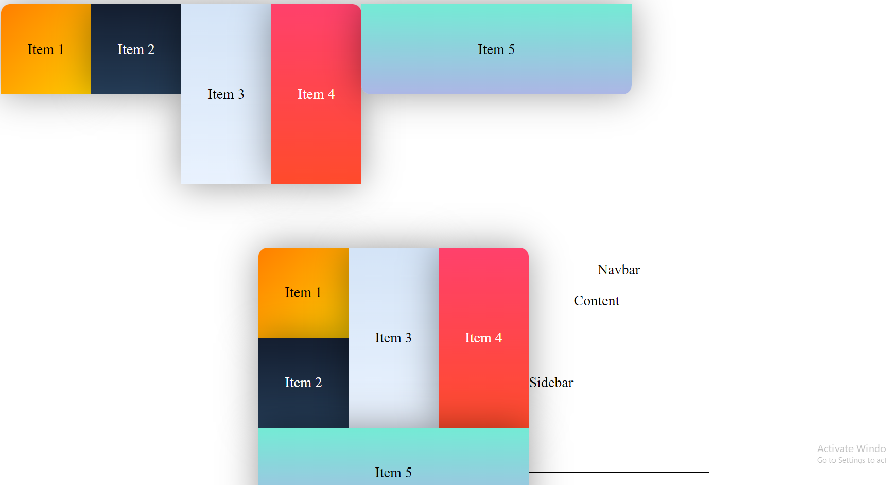
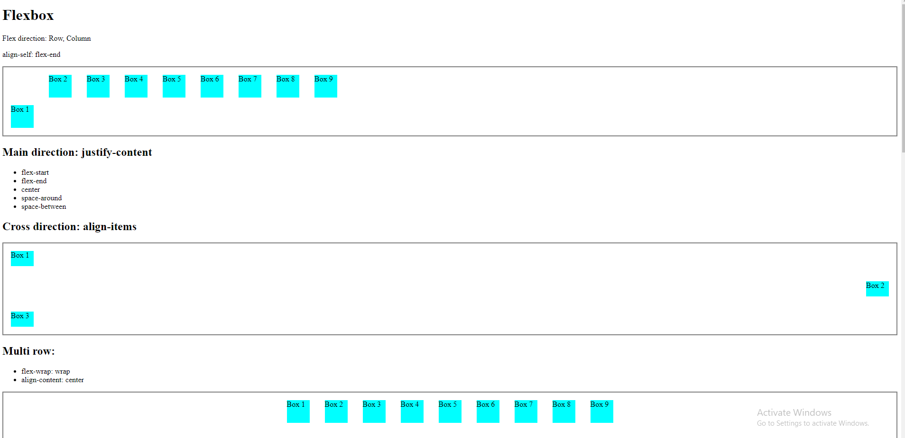
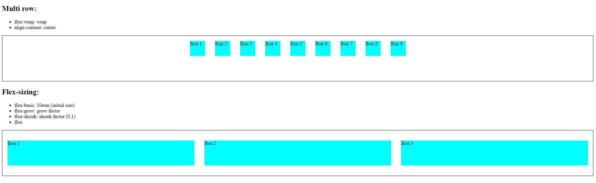

# Flexbox layout

- display:flex
- flex-direction: Row, Column
- justify-content: Үндсэн чиглэлийн дагуу удирдан ( `flex-start, `flex-end, `center, `space-around, `space-between)
- align-items: Эсрэг чиглэлийн дагуу удирдан `flex-start, `flex-end, `center, `space-around, `space-between

## Flex-sizing

- flex-basis: 10rem (initial size)
- flex-grow: Зайг томорч эзлэх утга
- flex-shrink: Зай агшихад жижигрэх утга (0,1)
- flex: 1 - Товч бичиглэл

