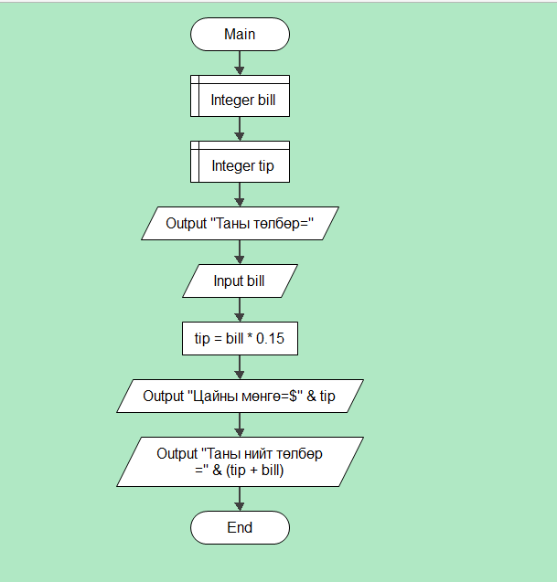
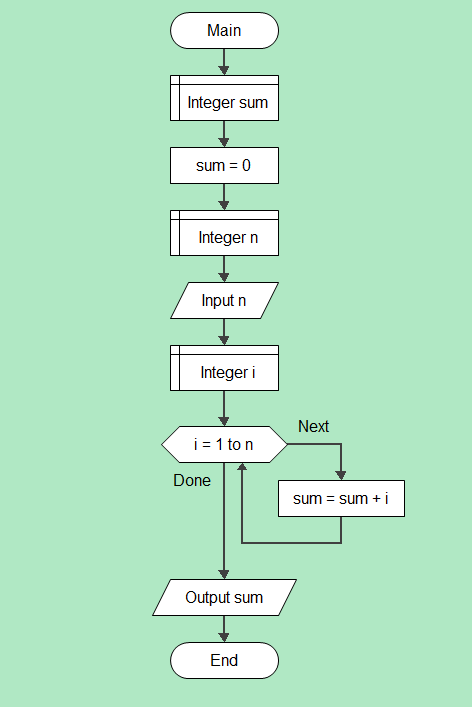
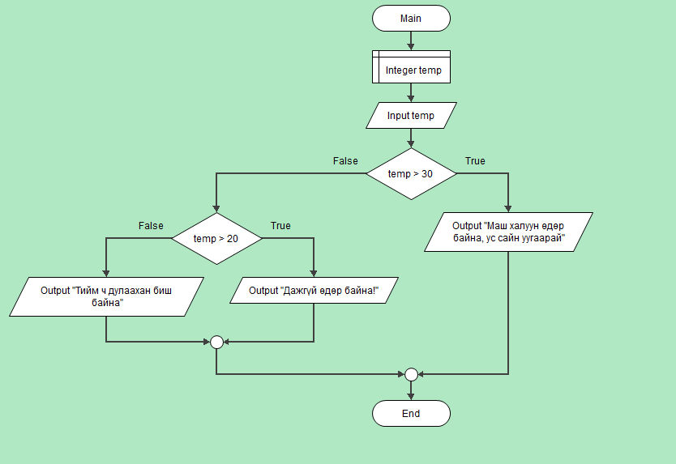

# Хичээл 14: JS Давтлага

- Хичээлийн бичлэг: https://youtu.be/8Bh2Dbe2st4

- Алгоритм: Алгоритм үр дүнд хүрэх алхамуудын олонлог
- Блок схем: http://www.flowgorithm.org/download/index.html

Жишээ 1: Төлбөр болон цайны мөнгөний нийлбэр олох бодлого


```sh
 // Алхам 1
     let billAmount = prompt("Та тооцооны дүнг оруулна уу?: ₮");

     // Алхам 2
     billAmount = parseFloat(billAmount);
     tipPercentage = 15;

     // Алхам 3
     let tipAmount = billAmount * (tipPercentage / 100);

     // Алхам 4
     let totalBill = billAmount + tipAmount;
     let result =
       "Таны нийт тооцоо (гарын мөнгө орсон): ₮" + totalBill.toFixed(2);
     // Алхам 5
     console.log(result);

```

Жишээ 2: Гараас өгсөн n тоо хүртэлх тооны нийлбэр ол.


```sh
let sum = 0;
const n = 100
for (let i = 1; i <= n; i++) {
    sum = sum + i;
    console.log("i=" + i, 'sum=' + sum)
}
console.log("Sum=" + sum)
```

Жишээ 3: Өнөөдрийн температур оруулахад хэр дулаан байгааг хэвлэ.


```sh

let temperature = prompt("Өнөөдрийн температур оруулна уу:");

// Гараас өгсөн утгийг тооруу хөрвүүлэх
temperature = parseFloat(temperature);

if (temperature > 30) {
  console.log("Маш халуун өдөр байна, ус сайн уугаарай");
} else if (temperature >= 20 && temperature <= 30) {
  console.log("Дажгүй өдөр байна!");
} else if (temperature < 20) {
  console.log("Тийм ч дулаахан биш байна");
} else {
  console.log("Буруу температур оруулсан байна.");
}

```

## Дасгал

1. 2 тооны ихийг олоод дэлгэцэнд харуулна уу. Функц ашиглана
2. Гараас тэгш өнцөгтийн өргөн, өндөр өгөх ба дүрс хэвтээ эсвэл босоо болохыг ол
3. Гараас өгсөн тоо хүртлэх тэгш эсвэл сондгой тоог ол

4. Гараас өгсөн тооны цуваанаас хамгийн их утгийг олдог findMaxNumber нэртэй функц бич

- Оролт [1,2,11,34,0,100]
- Гаралт 100

5. Гараас өгсөн тооны цувааг ихээс багаруу эрэмбэлдэг sort функц бич

- Оролт [1,2,11,34,0,100]
- Гаралт 100,34,11,2,1,0

6. Гараас өгсөн массив-н элементүүдийн байрыг урвуулж сольдог reverse нэртэй функц функц бич

- Оролт [1,2,11,34,0,100]
- Гаралт 100,0,34,11,2,1
