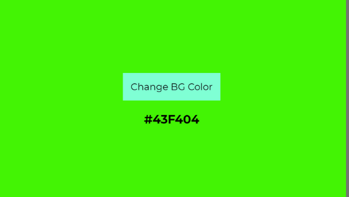

Хичээл 15: DOM manipulation

1. Element Selecting
   - id
   - class
   - tag name
2. Style change
3. Create element
4. Modify element
   - innerText
   - attributes & classess : setAttr, removeAttr, getAttr
   - delete element : remove()

Дасгал: Дэлгэцэн дээр товч байрлуулах бөгөөд товч дээр дарахад дэлгэцийн арын өнгийг хувиргана уу.
Random байдлаар хувиргаж болно, эсвэл ['red','blue','green',...] гэх мэт өнгөний жагсаалтаас сонгож болно.

