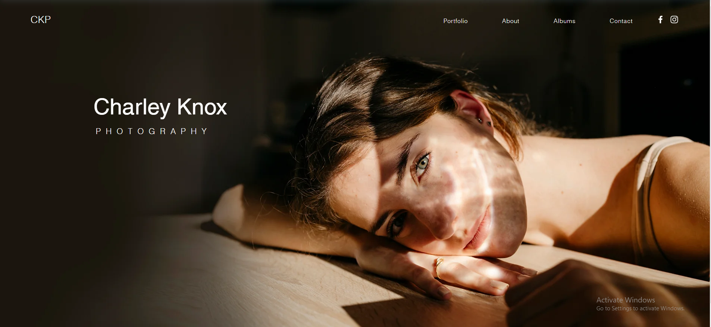

# Хичээл 18: Танилцуулга сайт

- HTML,CSS,JS ашиглан хийх веб сайтын загварыг сонгох
- Flex дасгал ажил, тоглоом: Flex layout ашиглан мэлхийг байрлуулах тоглоом: https://flexboxfroggy.com/
  

### Жишээ сайт:

1. https://ariuq.github.io/web-mba/index.html
2. https://www.wix.com/website-template/view/html/2839
   
   

## Багын ажил:

- Багаараа хийх веб хуудасны загвар хайж олно.
- Тэмцээн дээр хуваагдсан багаараа хамтран веб хөгжүүлж эхлэх бөгөөд цаашид хичээлээ багаараа хамтран хийнэ.
- Хичээлийн төгсгөлд хамгийн сайн хамтран ажиллаж веб бүтээсэн багийг шагнана.

## Үнэлгээний зарчим:

1. Багийн гишүүдийн эрц - (Багийн гишүүдийн эрцийг дундажлана)
2. Өдөр болгоны онооны нийлбэр
3. Веб сайтыг загвар, хийцийн хувьд үнэлэх
