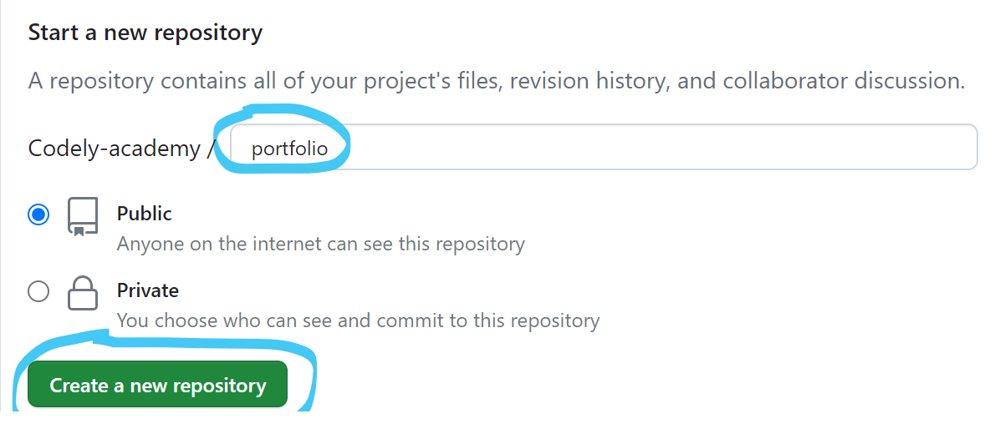
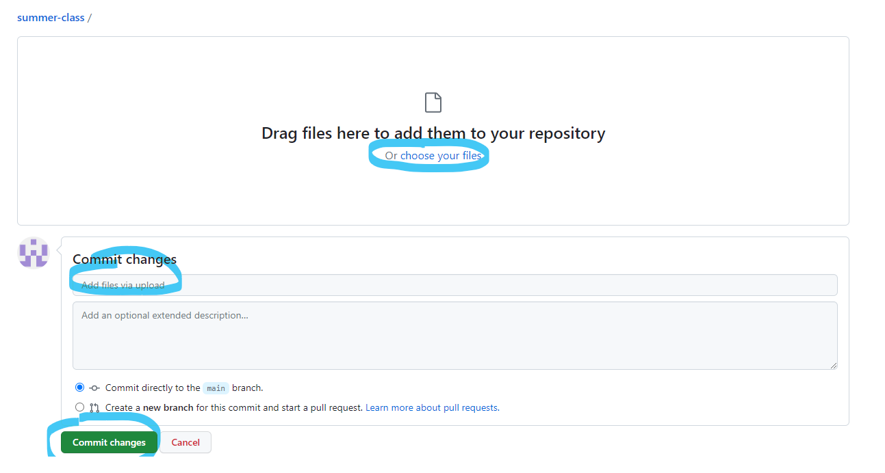
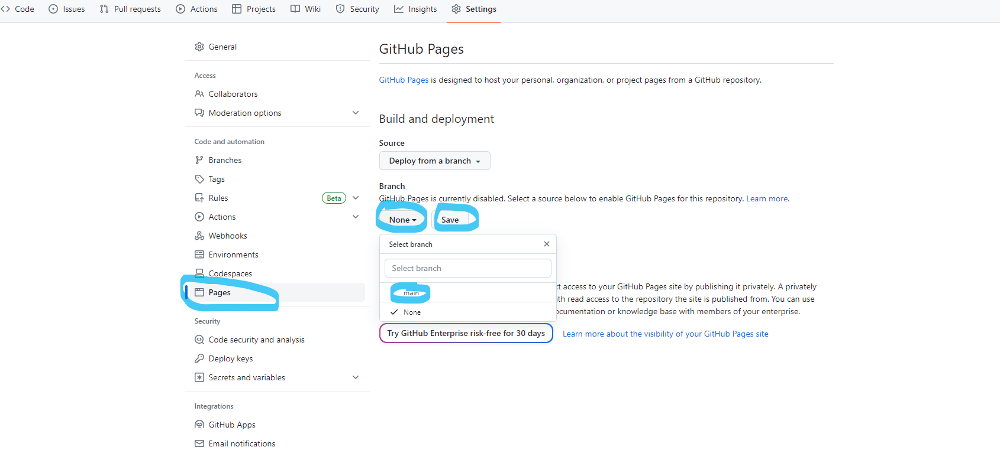

# Хичээл 22 - Github

## Бичсэн код оо github дээр тавих

1. Бүртгэл үүсгэх: https://github.com/signup
2. Шинэ repository (таны кодыг хадгалах хавцас гэж ойлгож болно) үүсгэнэ. Ингэхдээ нэр ээ бичээд Create товчийг дарна
   
3. Кодоо хуулж оруулах
   - Бичсэн кодоо хуулахын тулд үүсгэсэн repository дотор "upload existing file" гэсэн линк дээр дарна.

- "Choose your files" товч дарж файлуудаа сонгож оруулна
- Тухайн өөрчлөлтөнд тайлбар бичнэ
- "Commit changes" товч дарж өөрчлөлтийг батлаж файлуудаа хуулна
  

4. Таны оруулсан код repository дотор орж ирсэн байх болно
   

## Github pages ашиглан веб ээ бусдад харах боломжтойгоор тохируулах

1. Repository дотроос "Settings" цэс дээр дарна
   
2. Зүүн талын цэснүүдээс "Pages" цэс дээр дараад, Branch -> None гэсэн сонголтыг Main болгон солиод "save" товч дарна.
   

3. Ингээд хэсэг хугацааны дараа Settings->Pages цэсийг шалгахад дараах байдлаар таны хийсэн веб сайт бусад хүмүүс харах боломжтойгоор үүссэн байх болно.
   - Your site is live at https://codely-academy.github.io/portfolio/

