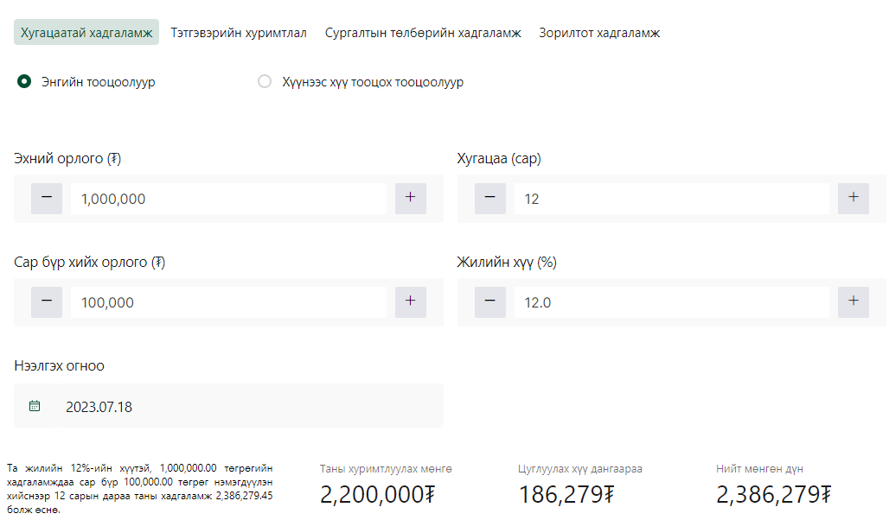

# Javascript функцтай ажиллах нь

## Хичээлийн бичлэг: https://youtu.be/erj5btotdQY

### 1. Arguments - Параметр

```sh
const sum = (x,y) =>{
 return x + y;
}
sum(3,2)
# Үр дүн: 5
sum(3)
# Үр дүн: NaN буюу 3 + undefined
sum(3,2,5,4)
# Үр дүн: 5 буюу эхний 2 утгийг аваад бусдыг ашиглахгүй
```

### 2. Rest operators: ...args буюу гаднаас өгч буй оролтуудыг массив хэлбэрээр хүлээн авна

```sh
const sum = (...args) => {
    console.log("args", args)
    // [1, 2, 3, 4]
    let total = 0
    for (const val of args) {
        total += val
    }
    return total
}
console.log(sum(1, 2, 3, 4))
# Үр дүн: 10

```

### 3. Default parameters - Анхны утгатай параметр

```sh
const getBill = (orders = [], tipPercentage = 5, badService = false)=> {
    if (orders.length === 0) {
        console.log('Захиалга байхгүй байна.');
        return;
    }

    let bill = 0;
    for (let i = 0; i < orders.length; i++) {
        bill += orders[i];
    }
    let tip = bill * tipPercentage / 100;

    if (badService) tip = 0;

    return { bill, tip };

}
let orders = [10000, 20000]
const result = getBill(orders, 10, true);
console.log(result);

```

### 4. Try and Catch: Алдаа барьж авах

```sh
const getBill = (orders = [], tipPercentage = 5, badService = false) => {
    try {
        if (!orders) {
            throw new Error('Захиалга алдаатай байна.');
        }
        if (orders.length === 0) {
            console.log('Захиалга байхгүй байна.');
            return;
        }

        let bill = 0;
        for (let i = 0; i < orders.length; i++) {
            bill += orders[i];
        }
        let tip = bill * tipPercentage / 100;

        if (badService) tip = 0;

        return { bill, tip };

    } catch (error) {
        alert("Алдаа гарлаа" + error)
    }
}
let orders = [10000, 20000]
const result = getBill(null, 10, true);
console.log(result);
```

### 5. Local vs Global scope: Хамрах хүрээ

```sh
var globalVariable = 'I am a global variable';

const myFunction = () => {
    var localVariable = 'I am a local variable';
    console.log(localVariable); // Output: I am a local variable
    console.log(globalVariable); // Output: I am a global variable
}
console.log(globalVariable); // Output: I am a global variable
console.log(localVariable); // Error: localVariable is not defined
```

### 6. This keyword:

"this" объектын аргын хүрээнд ашиглах үед тухайн объектыг өөрөө хэлнэ. Үүний утгыг тухайн аргыг дуудах үед тодорхойлно.

```sh
const person = {
  name: 'Баясгалан',
  sayHello: function() {
    console.log(`Сайн уу, намайг ${this.name} гэдэг`);
  }
};
person.sayHello(); // Output: Сайн уу, намайг Баясгалан гэдэг
```

## Дасгал ажил

1. average нэртэй функц үүсгээд гаднаас орж ирсэн бүх утгуудийн дундаж утгийг ол.

Оролт:

- average(100, 75, 85) => Үр дүн: 86.66

2. sum нэртэй функц үүсгээд гаднаас орж ирсэн бүх утгуудийн нийлбэрийг ол. Жич: Оролт нь доорхи 2 тохиолдолд ажиллах ёстой:

Оролт:

- sum([50,100,200,300])
- sum(50,100,200,300)

3. getArea буюу геометр дүрсний талбай олдог функц бич.
   Жич: Дүрс нь тойрог болон тэгш өнцөгт байх боломжтой. Өөр дүрсний төрөл орж ирвэл "Мэдэхгүй дүрс" гэсэн алдааны мсж гарган зогсоох. (try and catch ашиглана)

Оролт:

- getArea( 'circle' , {radius:1}) => PI \* radius \*\* 2 = 3.14
- getArea( 'rectangle' , {length:10, width:5}) => length \* width = 50

4. USD,EUR,YEN валютыг төгрөгруу хөрвүүлдэг convert нэртэй функц бичнэ үү.
   Жич:
   1USD=3500₮,
   EUR=3800₮
   YEN=25₮ тэй тэнцэх бөгөөд валютын төгрөгтэй тэнцэх утгийг гараас өгөх боломжтой.
   Оролт: Валютын ширхэг (Анхны утга: 100), Валютын төрөл (Анхны утга: 'usd')
   Үр дүн:

- convert() => 350000₮
- convert(100, 'usd', 3400) => 340000₮
- convert(200, 'eur') => 760000₮
- convert(300, 'yen') => 7500

<!-- 4.  Хаан банкны хадгаламжийн хүү болон нийт дүн тооцоолдог calcSavings функц бичнэ үү.
    Хүүний анхны утга жилийн 12 хувь байна.
    Оролтоор:

    - Эхний орлого (₮) - Анхны утга: 1000000
    - Хугацаа (сар) - Анхны утга: 12
    - Сар бүр хийх орлого (₮) - Анхны утга: 100000
    - Жилийн хүү (%) - Анхны утга: 12

      Үр дүн: savingInterest() => Хүү: 186,279 Нийт дүн: 2,386,279

     -->
