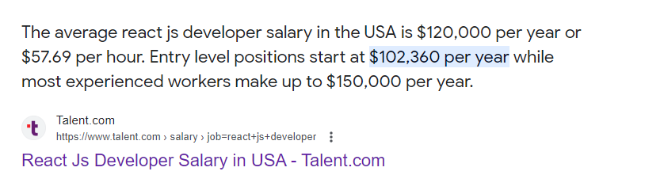
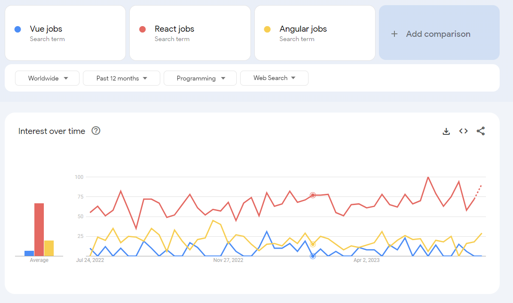
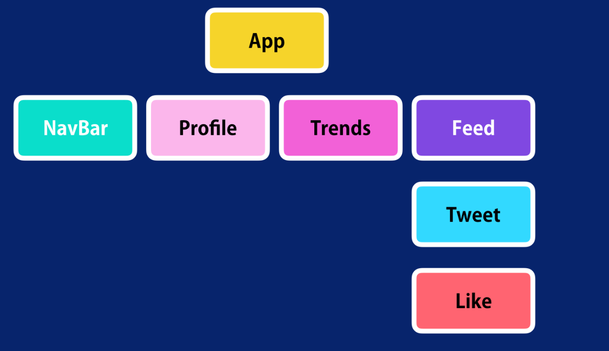

# Хичээл 26 - React эхлүүлцгээе

Getting Started (00:28)

## React гэж юу вэ?

- React нь JavaSript хэлэнд суурилсан user interface (UI) буюу хэрэглэгчийн харж, хэрэглэж буй тухайн нүүрэн хэсгийг зурах зорилготой гарсан сан (library) юм. 2013 онд хуучнаар Фэйсбүүк буюу Мета компань хөгжүүлэн гаргасан ба гарсан цагаасаа хөгжүүлэгчдийн дунд сенсац болж хөгжүүлэлтийн чиг хандлагийг өөрчилөн дараагийн шатанд гаргасан бүтээл болсон билээ. Өөрөөр хэлбэл фэйсбүүк компаний мэргэжлийн багийнхан таны хийж буй UI-г хамгийн хурдан, харилцан ажиллагаатай байхаар зохиомжлон гаргасан ба бид бүхэн тухайн асуудлийг react-д даатгаж веб үндсэн логик болон дэлгэцийн ажиллагаа дээр анхаарна гэсэн үг юм.
- React сурснаар:
  - Веб сайт
  - Гар утасны апп
  - Windows Desktop апп гэх мэт бүхий л төрлийн UI зурах боломжтой
- React ашигладаг компаниуд:
  - 
- USA-д react хөгжүүлэгчийн эрэлт болон цалин:
  - 
  - 
- [2023 онд ч гэсэн Javascript-ийн тренд, чиг хандлагийг React тэргүүлсээр байна ](https://trends.google.com/trends/explore?cat=31&q=Vue%20jobs,React%20jobs,Angular%20jobs)
  

- React апп-ийн хамгийн гол цөм болсон ойлголт нь компонент юм.

  - Компонент нь энгийнээр дэлгэцний жижиг бүрэлдэхүүн хэсэг гэж ойлгож болно. Нөгөө талаас бидний хийж буй дэлгэц нь маш олон жижиг хэсгүүдээс бүтдэг гэсэн үг. Тиймээс React хөгжүүлэгчид дахин ашиглах боломжтой, нэгнээсээ хамааралгүй компонентуудыг тус тусад нь хөгжүүлж тухайн хэсгүүдээ ашиглаж бүрэн дэлгэц бүтээдэг гэсэн үг.
  - 
  - 

- React апп нь дор хаяж 1 компоненттой байх бөгөөд тухайн компонент нь бусад дэлгэцэнд шаардлагатай бүх компонентүүдийг дотроо агуулна.
  
  

- React компонент-г хэрхэн бичдэг вэ?:


## React хөгжүүлэлтийн орчинг бэлдэцгээе.

1. Node.js татаж суулгах: https://nodejs.org/en. Node.js нь npm буюу өөрийн package manager тэй хамт суудаг. npm -г ашиглан бид 3 дагч нэмэлт сангууд суулгаж ашиглах боломжтой.
2. Терминал дээр доорхи команд уншуулан "create-react-app" програм суулгах. Энэ React апп үүсгэх зориулалттай програм юм.

```sh
npm install -g create-react-app
```

3. Vs code extension:

- Simple React Snippets

## Анхны React апп үүсгэх

- Терминал дээр доорхи команд уншуулан React апп үүсгэх:

```sh
create-react-app my-first-react
```

- Терминал дээр доорхи команд уншуулан React апп ажиллуулах:

```sh
cd my-first-react
npm start
```

## Hello World (5:25 )

```sh
import React from 'react'

const App = () => {
    return (
        <div>Hello World</div>
    )
}
```

## React апп хийхэд шаардлагатай JS ээ эргэн сэргээцгээе

1. let / const
2. Objects:

```sh
const car = {
  brand:'Toyota',
  name: 'Prius',
  price: 2000000,
  stop: ()=>{},
  move: ()=>{},
}

car.move();
car.stop();
console.log(car.price);
car.price = 1000000
console.log(car["price"]);

```

3. Arrow functions
4. Array map давталт
5. Object Destructure

```sh
const car = {
  brand:'Toyota',
  name: 'Prius',
  price: 2000000,
  stop: ()=>{},
  move: ()=>{},
}
# const brand = car.brand;
# const name = car.name;
# const price = car.price;

const {brand, name, price} = car
```

6. Spread operator

```sh
const numbers1 = [1,2,3]
const numbers2 = [4,5,6]

# const combined = numbers1.concat(numbers2)
const combined = [...numbers1,...numbers2]

// Object

const obj1 = {
  name: 'Bayasgalan',
}
const obj2 = {
  gender: 'Male',
}

const obj = {...obj1, ...obj2}


```

7. Modules
8. Named and Default
