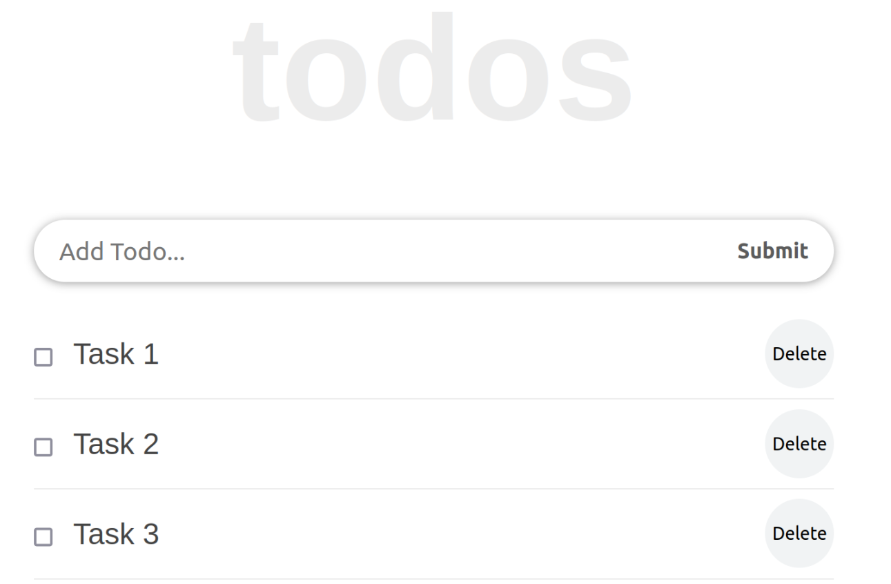

# React 3: TODO апп хийж үзэцгээе

1. Компонент-д хуваах
2. State буюу компонентийн төлвийн тухай
3. Props буюу компонентийн оролтын тухай
4. Ant Design:

- https://ant.design/docs/react/introduce
- https://ant.design/docs/react/use-with-create-react-app

4.

5. BMI буюу биеийн массийн индекс харуулдаг апп хийцгээе
6. Номин дэлгүүрээс бараа сонгож үнийг нь боддог апп хийцгээе: https://e-shop.nomin.mn/featured
   
