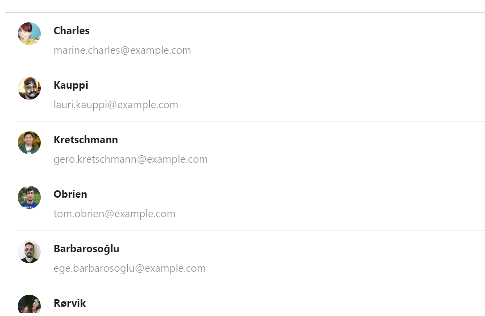

# Давтлага хичээл

## Дасгалын код: https://github.com/Codely-academy/React-lesson/blob/codespace-codely-academy-silver-parakeet-v6gjx5qqxp42wpgv/src/components/ListFilter.js

## Props:

- Properties буюу props нь компонентийн гаднаас авч буй оролтын утга юм.
- Компонентруу props-р дамжуулж болох утга:

  - Хувьсагч

    Компонентруу name нэртэй утга props-р дамжуулж байна.

    ```sh
    <Welcome name="Saraa" />;
    ```

    Компонент нь name нэртэй утгийг props-с авч харуулж байна.

    ```sh
    const Welcome = (props)=> {
      return <h1>Hello, {props.name}</h1>;
    }
    ```

- Функц
- Children буюу компонент дотор дамжуулж өгсөн контент

```sh
<Welcome name="Saraa" />;
```

## Up state , Single source of truth

## Children

### Дасгал:

1. Жагсаалтаас шүүх:
   
2. user-list.js датаг ашиглан хүмүүсийн жагсаалт харуулах бөгөөд нэрээр нь шүүх боломжтой байх.
   
