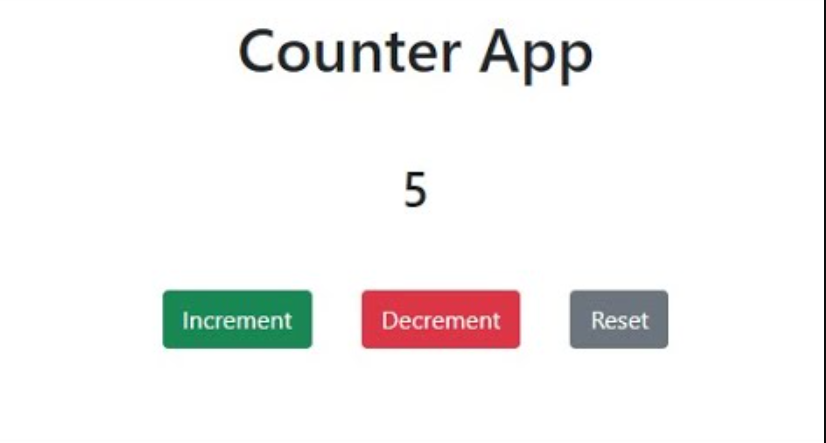
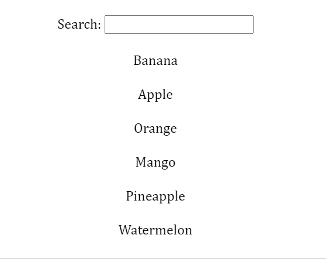

# React: Component lifecycle

## Даалгавар:

Өмнө нь хийсэн доорхи даалгаварууд дээрхи компонент дээр амьдралын мөчлөгийн дагуу бидний бичсэн код хэрхэн шилжиж ажиллаж байгааг ажиглан кодны ажиллах дарааллийг мөр мөрөөр нь тайлбарлаж бичнэ үү.
Ингэснээр та таны бичсэн react код хэрхэн ажиллаж байгаа зүй тогтол дарааллийг ойлгох бөгөөд кодоо юунаас эхлэх, яг хаана бичих гэх мэт асуудлыг шийдвэрлэж чадах юм.

- 
- 
- 
