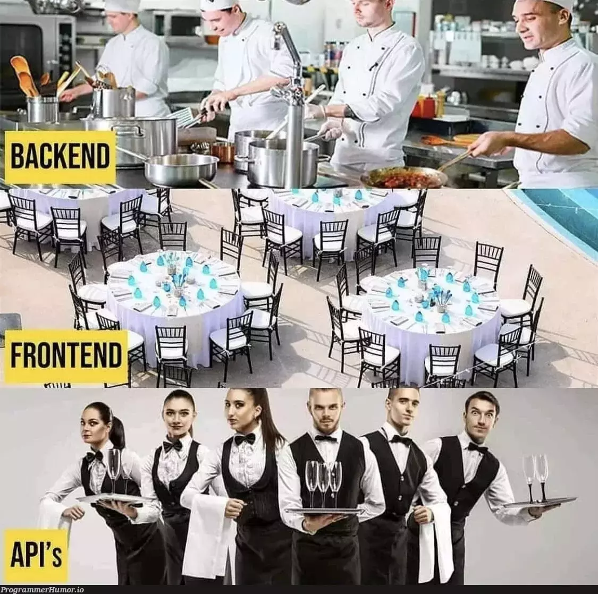
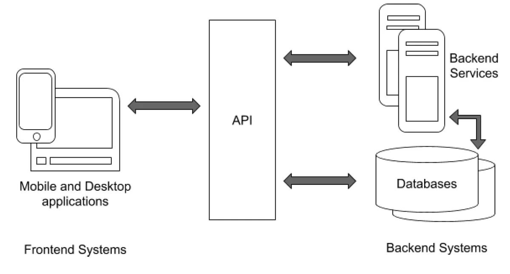
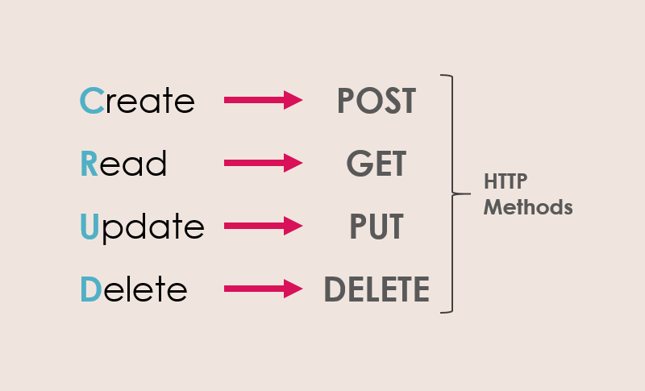

# React: Backend -тай харьцах

1. API:
   

   

2. HTTP хүсэлтийн төрлүүд:
   
3. Http хүсэлт шидэх үүрэгтэй сангууд: fetch, axios

```sh
   const response = await fetch("http://example.com/movies.json");
   const movies = await response.json();
   console.log(movies);
```

3. Javascript: async, await хэрэглээ

## Жишээ код: https://github.com/Codely-academy/React-lesson/blob/codespace-codely-academy-silver-parakeet-v6gjx5qqxp42wpgv/src/components/CallBackend.js

## Хичээлийн бичлэг: https://youtu.be/Wzwvd_dZgcg

## Даалгавар

1. Категори мэдээлэл:

- Backend URL: https://fakestoreapi.com/products/categories
- 

2. Бүх бүтээгдэхүүний мэдээлэл:

- https://fakestoreapi.com/products
- 

3. Категори дээр дарахад: Тухайн категорийн бүтээгдэхүүний жагсаалт харагдана

- https://fakestoreapi.com/products/category/jewelery
- 

4. Бүтээгдэхүүн дээр дарахад тухайн бүтээгдэхүүний "id" талбар ашиглан дэлгэрэнгүй мэдээлэл харагдана:

- https://fakestoreapi.com/products/1
- 

### Нэмэлт

5. Бүтээгдэхүүн дээр сагслах боломжтой товч байх бөгөөд дарах үед сагсанд орно. Сагсанд нийт үнийн дүн харагдана.

- 
- 
