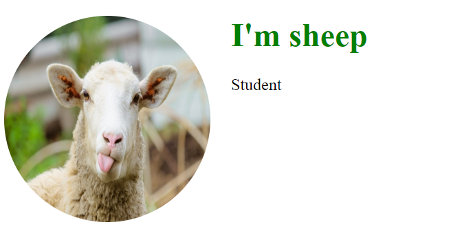

# Хичээл 1

### Slide: https://docs.google.com/presentation/d/1hvpN09CHAF3a5McmZTk7eJjVB13ocbsG22qKZfildN8/edit?usp=sharing

### Video:

- https://youtu.be/-AAQxRKrkRc
- https://youtu.be/7fsvcnMoD48

# Hands-on

### 1. HTML Basics:

- Heading section: meta tags - keywords, desc, charset, viewport
- Text: p, h1, em, strong,
- Link: a - url, newtab, download,
- Images:
- Entities

### 2. CSS Basics:

- styles
- link:css

### 3. Formatting Code:

### 4. Inspect Page (devtools) - DOM:

### 5. Summary:

### Дасгал 1

### Түвшин тогтоохын тулд хийсэн дэлгэц

