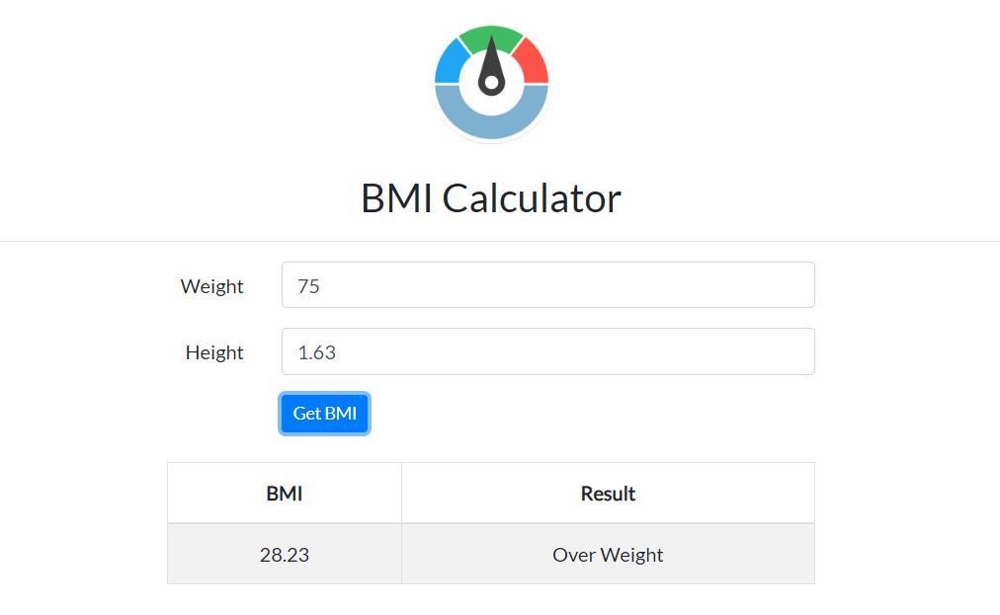
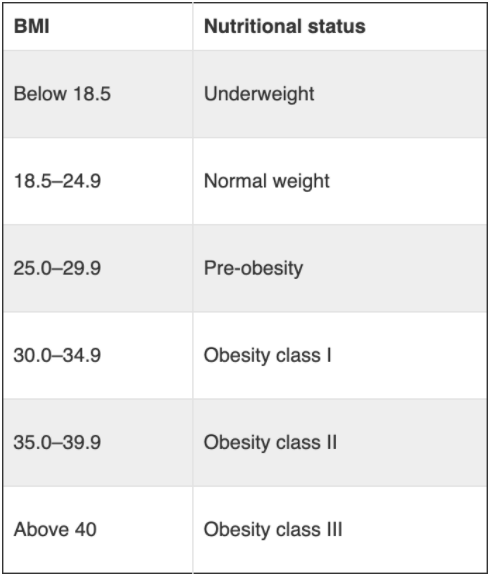

# React 4: state буюу - төлөв дасгал ажил

## Toggle button код: https://github.com/Codely-academy/React-lesson/blob/codespace-codely-academy-silver-parakeet-v6gjx5qqxp42wpgv/src/components/Toggle.js

### Жишээ

1. Toggle Button component буюу дарах үед On/Off болж солигддог товч.
   

```sh
import React, { useState } from 'react';

const ToggleButton = () => {
  const [isOn, setIsOn] = useState(false);

  const handleToggle = () => {
    setIsOn(!isOn);
  };

  return (
    <button onClick={handleToggle}>
      {isOn ? 'ON' : 'OFF'}
    </button>
  );
};

export default ToggleButton;
```

### Дасгал:

1. Counter буюу тоолуур:
   Доорхи зурган дээрхи шиг Increment - Тоог 1 ээр нэмэгдүүлдэг, Decrement - Тоог 1 ээр хорогдуулдаг, Reset - Тоог анхны буюу 0 утгатай болгодог 3 товчноос бүрдэх counter component хийнэ үү.

   

2. BMI (Body mass index) буюу биеийн массийн индекс харуулдаг апп хийцгээе.
   

   
